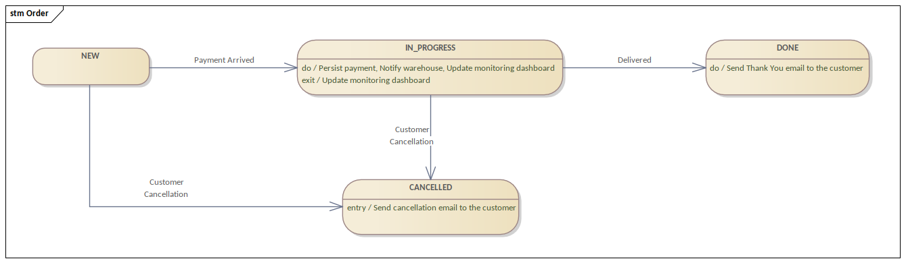

[](https://github.com/temofey1989/state-machine/actions/workflows/code-quality.yml)
[](https://www.apache.org/licenses/LICENSE-2.0)

# Overview

State Machine is a library for Kotlin projects which contains simple DSL to create state machine.

The Goal of the library is to create better connection between diagrams and the code.  
This will have a positive impact for better understanding of the code and better communications between SW analysts and developers.

---

## Dependencies

### Maven

```xml

<dependency>
  <groupId>io.justdevit.tools</groupId>
    <artifactId>state-machine</artifactId>
    <version>${state-machine.version}</version>
</dependency>
```

### Gradle

```groovy
implementation group: 'io.justdevit.tools', name: 'state-machine', version: $stateMachineVersion
```

### Gradle (kt)

```kotlin
implementation("io.justdevit.tools:state-machine:$stateMachineVersion")
```

---

## Features

### State Machine initialization

```kotlin
stateMachine<States, Events> {

    initialState = S0
    finalStates = setOf(S4, S5)

    ...
}
```

**Builder parameters**

* `id` - ID of the state machine (default: `randomUUID()`)
* `state` - State of the State Machine (default: `initialState` from configuration)
* `startup` - Startup mode of the State Machine (default: `AUTO`)

**Startup Modes**

* `AUTO` - State Machine will be started automatically.
* `LAZY` - State Machine should be started manually (`stateMachine.start()`).

### Define global actions

```kotlin
stateMachine<States, Events> {
    ...

    globalActions {
        +LogAction()
    }

    ...
}
```

### Define global guards

```kotlin
stateMachine<States, Events> {
    ...

    globalGuards {
        +FinalStateGuard()
    }

    ...
}
```

### Define transitions

```kotlin
stateMachine<States, Events> {
    ...

    from(S0) {

        to(S1).with(E0)

        to(S2).with(E1) {
            +MyGuard()
            +MyAction()
        }

    }

    ...
}
```

### Send event

Without parameters:

```kotlin
val stateMachine = ...

stateMachine.sendEvent(E1)
```

With parameters:

```kotlin
val stateMachine = ...

stateMachine.sendEvent(E1) {
    "order" to order
}
```

### Transition Guard

Each transition can have entry/exit guards.  
To create guard, the `TransitionGuard` interface should be implemented.

```kotlin
class MyGuard : TransitionGuard<States, Event> {
    override suspend fun onEntry(context: TransitionContext<States, Events>): Boolean {
        return ...
    }
}
```

There are two method you can implement:

* `onEntry` - check before entry to the state.
* `onExit` - check before exit from the state.

### Transition Action

Each transition can have some actions.  
To create action, the `TransitionAction` interface should be implemented.

```kotlin
class MyAction : TransitionAction<States, Events> {
    override suspend fun afterEntry(context: TransitionContext<States, Events>) {
        ...
    }
}
```

There are four method you can implement:

* `beforeEntry` - executes before entry to the state and before entry guard checks.
* `afterEntry` - executes after entry to the state and after entry guard checks.
* `beforeExit` - executes before exit from the state and before exit guard checks.
* `afterExit` - executes after exit from the state and after exit guard checks.

---

## Example (Orders)

For example, you can an application to manage orders of some e-shop.  
_(In real-life project the diagram will be more difficult, but you should get a point.)_

From the analyst you have such a diagram:  


We can see the that there are 4 states and 4 event types. Let's define them.

```kotlin
enum class OrderState {
    NEW, IN_PROGRESS, DONE, CANCELLED
}

enum class OrderEvent {
    PAYMENT_ARRIVED, DELIVERED, CUSTOMER_CANCELLATION
}
```

Then we can see that there are some actions in the diagram:

* Persist payment
* Notify warehouse
* Update monitoring dashboard
* Send cancellation email to the customer
* Send Thank You email to the customer

Let's define them:

```kotlin
class PersistPayment : TransitionAction<OrderState, OrderEvent> {
    override suspend fun afterEntry(context: TransitionContext<OrderState, OrderEvent>) {
        val payment = context.parameters["payment"] as Payment
        ...
    }
}

class NotifyWarehouse : TransitionAction<OrderState, OrderEvent> {
    override suspend fun afterEntry(context: TransitionContext<OrderState, OrderEvent>) {
        ...
    }
}

class UpdateMonitoringDashboard : TransitionAction<OrderState, OrderEvent> {
    override suspend fun afterEntry(context: TransitionContext<OrderState, OrderEvent>) {
        ...
    }
}

class SendCancellationEmail : TransitionAction<OrderState, OrderEvent> {
    override suspend fun afterEntry(context: TransitionContext<OrderState, OrderEvent>) {
        ...
    }
}

class SendThankYouEmail : TransitionAction<OrderState, OrderEvent> {
    override suspend fun afterEntry(context: TransitionContext<OrderState, OrderEvent>) {
        ...
    }
}
```

We also need some check that payment is correct. So, let's create a guard for this:

```kotlin
class RejectWrongPaymentAmount : TransitionGuard<OrderState, OrderEvent> {
    override suspend fun onEntry(context: TransitionContext<OrderState, OrderEvent>): Boolean {
        val order = context.parameters["order"] as Order
        val payment = context.parameters["payment"] as Payment
        return order.price == payment.amount
    }
}
```

Also, for technical purposes we will need logging action:

```kotlin
class LogAction : TransitionAction<OrderState, OrderEvent> {
    override suspend fun beforeExit(context: TransitionContext<OrderState, OrderEvent>) {
        println("Trying to move from state ${context.sourceState} to ${context.targetState} with ${context.event}.")
    }

    override suspend fun afterEntry(context: TransitionContext<OrderState, OrderEvent>) {
        println("Moved to state ${context.targetState} from ${context.sourceState} with ${context.event}.")
    }
}
```

Now we can describe our state machine with DSL:

```kotlin
val orderStateMachine = stateMachine<OrderState, OrderEvent>(state = order.state) {
    initialState = NEW
    finalStates = setOf(DONE, CANCELLED)

    globalActions { // Defining actions for each transition.
        +LogAction()
    }

    globalGuards { // Defining guards for each transition.
        finalStateGuard()
    }

    from(NEW) {

        to(IN_PROGRESS).with(PAYMENT_ARRIVED) {
            +RejectWrongPaymentAmount()

            +PersistPayment()
            +NotifyWarehouse()
            +UpdateMonitoringDashboard()
        }

        to(CANCELLED).with(CUSTOMER_CANCELLATION) {
            +SendCancellationEmail()
        }

    }

    from(IN_PROGRESS) {

        to(DONE).with(DELIVERED) {
            +SendThankYouEmail()
        }

        to(CANCELLED).with(CUSTOMER_CANCELLATION) {
            +SendCancellationEmail()
        }

    }
}
```

In the end we have pretty simple DSL for describing the state machine.  
Each action/guard can be tested with unit tests.
